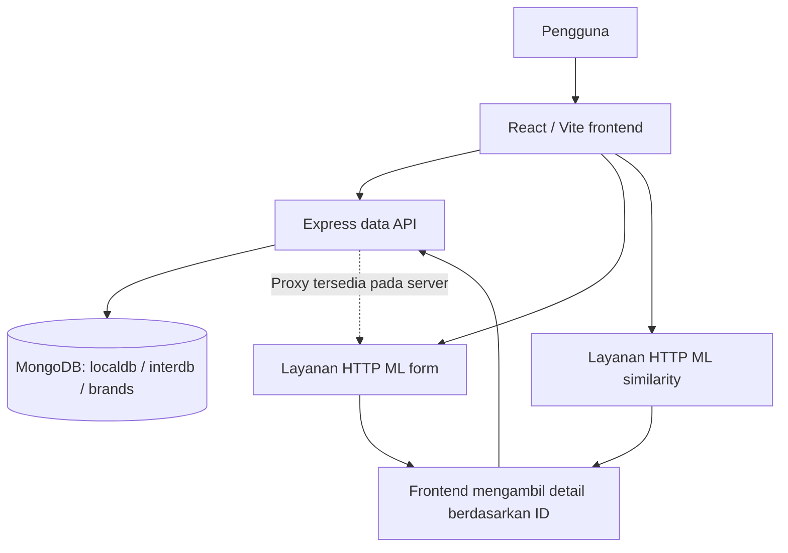
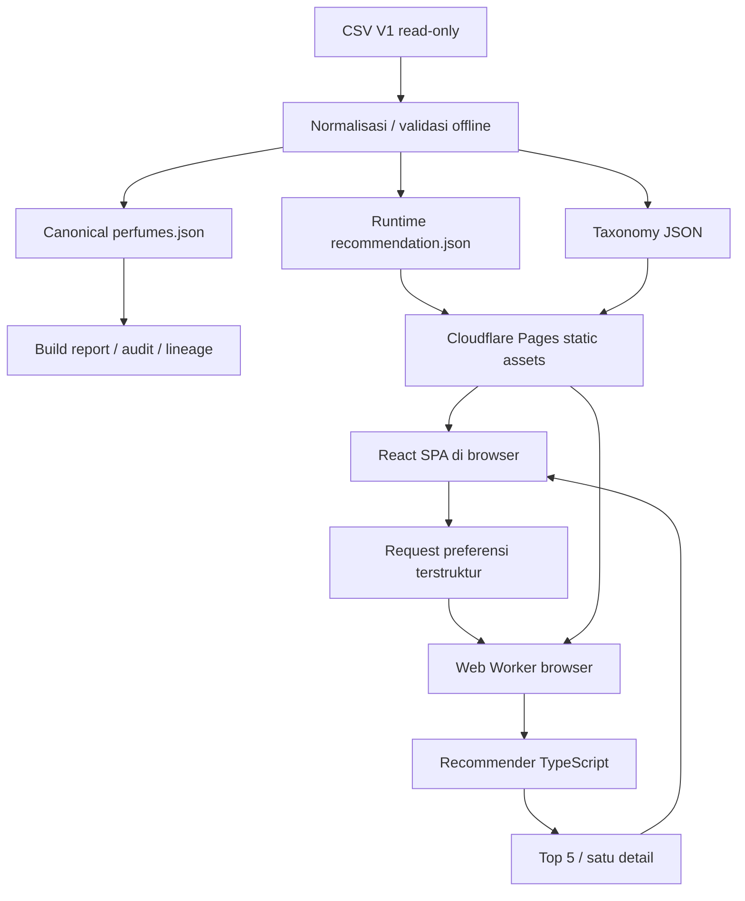

# Audit dan Perbandingan Harumnesia V2 dengan Harumnesia V1 Capstone

Tanggal audit: **6 Oktober 2026**. Dokumen ini membandingkan implementasi aktif `Harumnesia/harumnesia` dengan gabungan frontend/backend `harumnesia-febe-capstone` dan riset/data `harumnesia-ml-capstone`. Semua kesimpulan mengikuti snapshot commit pada bagian 2, bukan asumsi bahwa setiap fitur dalam roadmap sudah tersedia.

## 1. Kesimpulan utama

**Pembeda Harumnesia V2 mencakup produk, routes, halaman, fitur, data, algoritma, dan ekosistem operasional sekaligus. Perubahan paling mendasar adalah penyempitan fokus produk dan pemindahan runtime rekomendasi dari layanan eksternal ke browser.**

V1 merupakan produk eksplorasi parfum yang relatif luas: pengguna dapat melihat katalog, menelusuri brand, membaca edukasi, mengisi preferensi, atau mencari alternatif dari parfum favorit. V2 saat ini merupakan pengalaman discovery yang lebih terfokus: memilih notes, accords, dan batas pencarian; menerima daftar pendek beserta alasannya; lalu membuka detail parfum.

Secara sistem, V1 memisahkan aplikasi React, Express API, MongoDB, dan integrasi layanan ML. Repository ML menyimpan dataset, notebook, dan artefak model. V2 membangun ulang fondasinya menjadi monorepo TypeScript dengan dataset JSON tervalidasi dan recommender mandiri yang dijalankan dalam Web Worker. Cloudflare Pages menyajikan aplikasi dan aset statis; tidak ada backend rekomendasi produksi pada snapshot ini.

Konsekuensinya, **V2 lebih sederhana untuk dioperasikan dan lebih eksplisit dalam kontrak data serta penjelasan rekomendasi, tetapi belum setara dengan keluasan fitur V1**. Katalog penuh, penelusuran brand, edukasi khusus, dan rekomendasi dari parfum favorit belum tersedia sebagai pengalaman pengguna V2. Menganggap V2 sebagai pengganti semua kemampuan V1 akan berlebihan.

Audit ini juga tidak membuktikan V2 lebih akurat dalam memahami selera manusia. Test, determinisme, dan evaluasi offline V2 memberikan bukti kualitas engineering. Notebook V1 memberikan bukti eksperimen representasi fitur dan clustering. Keduanya belum menyediakan eksperimen pengguna yang cukup untuk menyimpulkan pemenang kualitas rekomendasi.

## 2. Ruang lingkup, metode, dan snapshot

### 2.1 Baseline yang benar-benar diperiksa

| Repository                                                                    | Branch baseline | Commit yang diaudit                        | Peran                                                                      |
| ----------------------------------------------------------------------------- | --------------- | ------------------------------------------ | -------------------------------------------------------------------------- |
| [Harumnesia V2](https://github.com/Harumnesia/harumnesia)                     | `main`          | `2c7cf1fad554cf555d5096cdb1450a665c44e4c5` | Aplikasi aktif, recommender, data pipeline, UI, dan dokumentasi deployment |
| [V1 frontend/backend](https://github.com/Harumnesia/harumnesia-febe-capstone) | `final`         | `7960b5b9c1d1aff49ec856059e669c3f12bf32cc` | Aplikasi capstone, Express, MongoDB, integrasi ML                          |
| [V1 ML](https://github.com/Harumnesia/harumnesia-ml-capstone)                 | `main`          | `96e1aab186883d2e8a44f3cae9e00969b26ad942` | Dataset historis, preprocessing, eksperimen, artefak model                 |

Commit lokal kedua V1 cocok dengan remote GitHub saat audit melalui `git ls-remote`. Default remote frontend/backend mengarah ke `final`; default ML mengarah ke `main`. V2 lokal dan remote `main` juga cocok. Repository V1 hanya dibaca, tanpa checkout branch lain, instalasi, perubahan file, atau retraining.

### 2.2 Cara menarik kesimpulan

Audit menelusuri registrasi route, isi halaman, pemetaan form, konfigurasi integrasi, API, model database, source notebook, schema V2, pipeline data, scoring, worker, CI, dan deployment. Hitungan data dan beberapa temuan CSV diverifikasi kembali, bukan hanya disalin dari README. V2 menjalani validasi dataset, test, smoke test recommender/integrasi, serta pemeriksaan CI dan aset publik.

Dokumen membedakan empat jenis bukti:

- **Implementasi:** perilaku terlihat langsung dalam source pada commit baseline.
- **Hasil verifikasi:** pemeriksaan yang dijalankan dalam audit ini.
- **Catatan historis:** hasil evaluasi/performa yang tersimpan dalam dokumentasi atau report repository, dengan batasnya tetap disebutkan.
- **Analisis atau usulan:** implikasi produk dan rekomendasi lanjutan; bukan fitur yang sudah ada.

### 2.3 Batas audit

Layanan ML HTTP yang dihubungi frontend V1 **tidak memiliki source server inferensi lengkap dalam kedua snapshot repository tersebut**. Notebook dan artefak model membuktikan pendekatan riset, sementara frontend membuktikan kontrak request/response yang diharapkan. Kesesuaian penuh notebook dengan layanan yang pernah dideploy tidak dapat dipastikan hanya dari repository ini.

Audit tidak menjalankan notebook, memuat file `.pkl`/`.h5`, mengakses database historis, atau mengirim request mutasi ke API V1. Status hidup/mati endpoint V1 dan kontrol keamanan tambahan di luar source tidak diuji. Tidak ada benchmark V1 versus V2 pada hardware, corpus, dan query yang disamakan. Karena itu, klaim kecepatan relatif, biaya nominal, akurasi, atau insiden keamanan produksi tidak dibuat.

## 3. Matriks pembeda utama

| Dimensi               | V1 capstone                                                                                    | V2 aktual                                           | Makna perubahan                                                                   |
| --------------------- | ---------------------------------------------------------------------------------------------- | --------------------------------------------------- | --------------------------------------------------------------------------------- |
| Fokus produk          | Eksplorasi katalog + brand + edukasi + dua metode rekomendasi                                  | Discovery preferensi + hasil explainable + detail   | Fokus lebih sempit, dengan kedalaman pada satu perjalanan pengguna                |
| URL aplikasi          | 14 pola route selain catch-all, beberapa alias                                                 | 4 pola route utama selain catch-all                 | Pengurangan cakupan dan penyatuan alur; bukan sekadar rename URL                  |
| Pilihan metode        | Form preferensi dan similarity dari parfum favorit                                             | Satu flow preferensi terstruktur                    | Use case alternatif parfum favorit belum dipindahkan                              |
| Input aroma           | Deskripsi bebas pada form, atau pilihan parfum acuan                                           | Pilihan canonical notes/accords                     | Lebih dapat ditelusuri, tetapi pengguna harus mengenali istilah aroma             |
| Bahasa UI             | Mayoritas Bahasa Indonesia                                                                     | Mayoritas Bahasa Inggris                            | Ada perubahan aksesibilitas bahasa untuk pasar lokal                              |
| Frontend              | React + Vite + JavaScript + Tailwind                                                           | React + Vite + TypeScript + CSS editorial           | React/Vite tetap; kontrak dan presentasi dibangun ulang                           |
| Backend aplikasi      | Express + Mongoose                                                                             | Tidak ada backend aplikasi produksi                 | Mengurangi service dependency dan kemampuan mutasi server                         |
| Penyimpanan produksi  | MongoDB melalui API                                                                            | JSON statis yang dibangun offline                   | Data dipublikasikan sebagai snapshot release                                      |
| Runtime rekomendasi   | Request HTTP ke layanan ML eksternal                                                           | TypeScript dalam Web Worker browser                 | Komputasi dan memori pindah ke perangkat pengguna                                 |
| Model form pada riset | TF-IDF, one-hot, scaling, autoencoder, K-Means, cosine                                         | IDF sparse notes/accords, weighted scoring, MMR     | Representasi, ruang pencarian, dan ranking berbeda                                |
| Explainability        | Metadata ML seperti cluster/extracted notes; tidak ada kontrak kontribusi fitur yang setara V2 | Match metadata, coverage, component scores, reasons | Bukti rekomendasi menjadi output engine yang eksplisit                            |
| State hasil           | Form/result disimpan di `localStorage` pada flow form                                          | React context dalam memori                          | Refresh hasil V2 menghapus sesi rekomendasi                                       |
| Foto produk           | URL sumber dan foto fallback yang dipakai lintas produk                                        | Manifest foto produk lokal, saat ini 0 entri        | Identitas visual lebih hati-hati, katalog kurang mudah dikenali                   |
| Testing               | Tidak ditemukan suite otomatis yang setara pada snapshot                                       | Vitest, schema/data validation, smoke, CI           | Bukti regresi V2 lebih kuat                                                       |
| Infrastruktur         | Konfigurasi long-running Express, PM2, database dan layanan terpisah                           | Cloudflare Pages + aset statis                      | Operasi lebih ringan; browser tetap menanggung biaya runtime                      |
| Research workspace    | Notebook dan model tersedia di repository ML                                                   | Tidak ada direktori `ml/` pada snapshot aktif       | Pemisahan riset adalah arah arsitektur; migrasi riset ke monorepo belum dilakukan |

Bukti utama: [routes V1][v1-routes], [routes V2][v2-routes], [form V1][v1-form], [form V2][v2-form], [runtime V2][v2-worker], [notebook form][ml-form], [notebook similarity][ml-similarity].

## 4. Routes dan halaman: perubahan nyata

### 4.1 Route V1

| Route V1                             | Komponen                   | Fungsi aktual / catatan                                                  |
| ------------------------------------ | -------------------------- | ------------------------------------------------------------------------ |
| `/`                                  | `Home`                     | Landing dengan navigasi ke fitur lain                                    |
| `/catalog`                           | `Catalog`                  | Daftar parfum dari API, pagination, pencarian nama/brand                 |
| `/brands`                            | `Brands`                   | Daftar nama brand, pencarian dan pengurutan                              |
| `/brands/:brandId`                   | `BrandDetail`              | Terdaftar, tetapi ada ketidaksesuaian parameter pada implementasi        |
| `/brand/:brandName`                  | `BrandDetail`              | Halaman parfum berdasarkan nama brand                                    |
| `/edukasi`                           | `Edukasi`                  | Konten piramida aroma, keluarga notes, konsentrasi, terminologi          |
| `/recommendation-method`             | `RecommendationMethod`     | Memilih dua metode rekomendasi                                           |
| `/recommendation`                    | `Recommendation`           | Form preferensi yang memanggil layanan ML form                           |
| `/recommendation/similarity`         | `SimilarityRecommendation` | Pilih brand/parfum favorit; hasil ditampilkan pada halaman yang sama     |
| `/recommendation/results`            | `RecommendationResults`    | Membaca hasil form dari `localStorage`                                   |
| `/recommendation/similarity/results` | `RecommendationResults`    | Route terdaftar; flow similarity yang diperiksa tidak menavigasi ke sini |
| `/about-us`                          | `AboutUs`                  | Informasi proyek/tim                                                     |
| `/perfume/:id`                       | `PerfumeDetail`            | Detail melalui API lokal, notes dan parfum satu brand                    |
| `/perfume-static/:id`                | `PerfumeDetailStatic`      | Placeholder yang menyatakan detail berdasarkan ID akan diterapkan nanti  |
| `*`                                  | `NotFound`                 | Halaman tidak ditemukan                                                  |

Jumlah route bukan jumlah fitur independen. Dua route brand berbagi komponen, dua route hasil berbagi komponen, dan flow similarity langsung menyimpan hasil dalam state halaman. Selain catch-all, ada **14 pola URL dan 12 komponen halaman berbeda**.

Temuan yang memengaruhi interpretasi:

1. `BrandDetail` membaca `brandName` dari `useParams()`, sedangkan `/brands/:brandId` menyediakan `brandId`. Route tersebut tidak dapat dianggap alias yang sehat tanpa penyesuaian. Link yang memakai `/brand/:brandName` mengikuti parameter yang dibaca komponen.
2. `EdukasiDetail.jsx` ada dan membaca `slug`, tetapi `/edukasi/:slug` tidak diregistrasikan di `App.jsx`. Keberadaan file tersebut tidak berarti halaman detail edukasi dapat diakses melalui router baseline.
3. Label parfum serupa pada detail V1 berasal dari filter **brand yang sama**, maksimal empat item, bukan pemanggilan cosine similarity. Ini berbeda dengan fitur similarity pada halaman rekomendasi.
4. Katalog utama dan detail memakai `/api/perfumes`, yang modelnya mengarah ke `localdb`. Dropdown similarity menggabungkan data lokal dan internasional melalui API tambahan. Jadi cakupan internasional tidak otomatis sama pada semua halaman V1.
5. `PerfumeDetailStatic` hanya menampilkan placeholder dan ID. Ia dihitung sebagai registered page, tetapi tidak sebagai kemampuan detail parfum yang lengkap. Route count V1 juga tidak berarti seluruh 14 route sehat atau setara tingkat penyelesaiannya.

Bukti: [router][v1-routes], [brand detail][v1-brand-detail], [edukasi][v1-education], [detail edukasi][v1-education-detail], [detail parfum][v1-detail], [placeholder detail][v1-static-detail], [API client][v1-api].

### 4.2 Route V2

| Route V2       | Komponen            | Fungsi aktual                                                               |
| -------------- | ------------------- | --------------------------------------------------------------------------- |
| `/`            | `LandingPage`       | Hero editorial, penjelasan alur, preview collection, CTA discovery          |
| `/discover`    | `DiscoverPage`      | Preferensi dan hard boundaries, pencarian taxonomy, ringkasan pilihan       |
| `/results`     | `ResultsPage`       | Hasil sesi rekomendasi; no-session jika dibuka tanpa hasil dalam memori     |
| `/perfume/:id` | `PerfumeDetailPage` | Detail berdasarkan canonical ID lokal/internasional, tanpa perlu sesi hasil |
| `*`            | `NotFoundPage`      | Halaman tidak ditemukan                                                     |

V2 memiliki **empat pola URL utama dan lima komponen halaman termasuk 404**. Navigasi “Notes” dan “About” adalah anchor ke bagian landing, bukan `/notes` atau `/about`. Tombol “Explore fragrances” mengarah ke preview collection dalam landing, bukan katalog penuh. Menu “Results” muncul setelah hasil tersedia.

Keberadaan 25.127 record dalam dataset tidak berarti ada halaman katalog 25.127 produk. Dataset mendukung rekomendasi dan lookup detail, sementara cara pengguna menemukan ID di luar hasil belum berupa pencarian katalog.

Bukti: [router V2][v2-routes], [landing][v2-landing], [layout][v2-layout], [results][v2-results].

### 4.3 Apakah ini hanya perubahan nama route?

Tidak. `/recommendation` dan `/discover` memiliki tujuan yang mirip, tetapi input, kontrak request, runtime, dan outputnya berubah. `/recommendation/results` dan `/results` juga berbeda dalam persistence dan cara memperoleh data. `/perfume/:id` terlihat sama, tetapi identitas V1 dan canonical ID V2 tidak setara.

Tidak ditemukan redirect atau adapter ID untuk URL lama dalam router V2. Jika V2 menjadi pengganti pada domain V1, link seperti `/catalog`, `/brands`, atau `/recommendation` akan masuk catch-all, sementara legacy perfume ID dapat menjadi not-found. **Rencana migrasi URL perlu dibuat tersendiri**; mengganti hosting atau domain tidak menyelesaikan kompatibilitas link lama.

## 5. Perbandingan perjalanan pengguna

### 5.1 Pengguna ingin mencari parfum tanpa mengetahui notes

**V1:** memilih metode form → mengisi gender, waktu pakai, budget, konsentrasi, ukuran botol, dan deskripsi aroma → request ML → pengayaan detail dari API → halaman hasil. Lima pilihan terstruktur wajib; deskripsi dapat kosong. Notebook riset memperlihatkan ekstraksi notes dari bahasa alami dengan Gemini/LangChain.

**V2:** membuka discovery → memilih notes/accords serta preferensi opsional → mengatur market/budget atau strict filters → hasil → detail. Input aroma memakai vocabulary terstruktur, tanpa penerjemah bahasa alami. Pengguna yang sudah mengenali “vanilla”, “amber”, atau “woody” memperoleh kontrol langsung; pemula yang hanya tahu “ingin segar untuk kerja” belum mendapat interpretasi intent otomatis.

V2 menurunkan ketergantungan API dan ambiguitas hasil ekstraksi, tetapi memindahkan beban pemahaman istilah kepada pengguna. Suggested chips membantu memulai, namun tidak menggantikan edukasi atau pemetaan bahasa sehari-hari.

### 5.2 Pengguna sudah punya parfum favorit dan ingin alternatif lokal

**V1:** memilih metode similarity → mencari brand/parfum pada dropdown gabungan → mengirim nama parfum ke layanan similarity → menerima hasil dan pengayaan metadata. Notebook similarity secara eksplisit memfilter hasil ke record `is_lokal`, sehingga use case internasional sebagai acuan untuk menemukan parfum lokal terlihat pada source riset.

**V2:** belum ada pemilih parfum acuan atau action “find similar”. Pengguna harus menerjemahkan parfum favoritnya menjadi notes/accords sendiri dan memilih market local jika ingin membatasi hasil lokal. Ini adalah gap produk yang penting, terutama untuk identitas Harumnesia sebagai jembatan penemuan parfum lokal.

Engine V2 memiliki `excludeIds` dan preference notes/accords sehingga foundation untuk flow berbasis parfum acuan tersedia. Tetapi foundation tersebut **belum menjadi fitur end-to-end**: masih dibutuhkan pencarian acuan, pemetaan profil, action UI, dan validasi hasil. Menggunakan notes acuan sebagai request juga tidak identik dengan latent similarity V1.

### 5.3 Pengguna hanya ingin membaca atau menelusuri brand

V1 menyediakan entry point katalog, brand, dan edukasi tanpa harus meminta rekomendasi. V2 memiliki konten ringkas pada landing dan detail setelah discovery, tetapi belum punya pengalaman browsing bebas atau pusat edukasi tersendiri. Untuk pengguna yang belum siap memilih preferensi, entry point V2 menjadi lebih terbatas.

### 5.4 Pengguna kembali atau melakukan refresh

Flow form V1 menyimpan hasil dan input di `localStorage`, sehingga hasil dapat dibaca kembali oleh halaman results. Ini adalah persistence pada browser, **bukan akun, sinkronisasi perangkat, atau history di server**. Implementasinya juga berpotensi menampilkan hasil lama tanpa penanda masa berlaku.

V2 menyimpan form terakhir dan hasil dalam React context. Navigasi dalam sesi SPA dapat mempertahankannya; refresh `/results` menampilkan no-session. Direct detail tetap bisa berjalan melalui lookup canonical ID, tetapi alasan “mengapa direkomendasikan untuk Anda” hanya tersedia jika hasil yang cocok ada dalam sesi.

Trade-off V2: lifecycle lebih sederhana dan tidak meninggalkan hasil persistennya sendiri, tetapi pengguna kehilangan kemampuan melanjutkan hasil setelah refresh, membuka hasil yang sama di tab lain, atau membagikan daftar rekomendasi melalui URL.

## 6. Matriks fitur produk

| Kemampuan                            | V1                                                              | V2 aktual                                          | Penilaian                                                     |
| ------------------------------------ | --------------------------------------------------------------- | -------------------------------------------------- | ------------------------------------------------------------- |
| Landing                              | Ada                                                             | Ada, editorial                                     | Dipertahankan dengan presentasi baru                          |
| Katalog dengan pagination            | Ada, 12 item per halaman                                        | Tidak ada route katalog                            | Gap cakupan produk                                            |
| Pencarian nama parfum/brand          | Ada pada katalog dan dropdown                                   | Tidak ada pencarian katalog                        | Taxonomy search V2 adalah fungsi berbeda                      |
| Daftar brand dan produk brand        | Ada                                                             | Tidak ada                                          | Belum dipindahkan                                             |
| Halaman edukasi khusus               | Ada                                                             | Konten landing/detail yang terbatas                | Belum setara                                                  |
| About/tim khusus                     | Ada                                                             | Anchor penjelasan alur                             | Informasi institusional berkurang                             |
| Pemilihan metode rekomendasi         | Dua jalur                                                       | Satu jalur                                         | Penyederhanaan sekaligus kehilangan use case                  |
| Deskripsi aroma bebas                | Ada dalam form dan riset NLP                                    | Tidak ada                                          | Lebih sedikit interpretasi bahasa alami                       |
| Preferensi notes eksplisit           | Melalui deskripsi/fitur model                                   | Ada, multiselect taxonomy                          | Kontrol pengguna lebih langsung                               |
| Preferensi accords eksplisit         | Tidak terlihat sebagai form equivalent                          | Ada                                                | Kemampuan baru pada UI preference                             |
| Preferred gender                     | Pilihan wajib pada form                                         | Soft preference opsional                           | Semantik lebih fleksibel                                      |
| Waktu / occasion                     | Day, Night, Versatile                                           | `day`, `night`, `versatile`                        | Bukan taxonomy Date Night/Work dari mockup                    |
| Konsentrasi                          | EDT, EDP, XDP pada form                                         | Nilai normalized; observed EDP/EDT, XDP unresolved | Lebih konservatif terhadap bukti data                         |
| Ukuran botol dalam rekomendasi       | Ada                                                             | Tidak ada dalam request/UI                         | Fitur V1 belum setara; volume tetap ada di canonical data     |
| Budget                               | Min/max hasil pemetaan tier                                     | Batas maksimum IDR                                 | Range harga dua sisi belum tersedia                           |
| Pemilihan market                     | Gabungan pada pemilih acuan; hasil lokal di notebook similarity | All/local/international eksplisit                  | Kontrol candidate pool yang lebih langsung                    |
| Strict gender/occasion/concentration | Tidak ada pemisahan UI yang setara                              | Advanced options                                   | Pemisahan preferensi dari syarat wajib                        |
| Excluded notes                       | Tidak terlihat equivalent                                       | Ada                                                | Batas exact note, bukan jaminan alergi/formulasi              |
| Kebijakan harga tidak diketahui      | Fallback nilai pada sejumlah komponen                           | Include/exclude unpriced                           | Ketidaklengkapan lebih eksplisit                              |
| Alasan rekomendasi                   | ML metadata dan data profil                                     | Reasons dari actual matches                        | Pembeda V2 yang kuat                                          |
| Diversifikasi hasil                  | Tidak terlihat MMR dalam notebook yang diperiksa                | MMR                                                | Mengurangi redundansi profil, tanpa quota brand               |
| Detail lokal dan internasional       | Detail utama melalui koleksi lokal                              | Lookup runtime kedua market                        | Cakupan detail lebih konsisten, metadata tampil lebih sedikit |
| Parfum terkait pada detail           | Satu brand, maksimal empat                                      | Tidak ada daftar related perfumes                  | Gap eksplorasi lanjutan                                       |
| Persistence hasil                    | `localStorage` flow form                                        | Memori sesi                                        | Trade-off, bukan selalu peningkatan                           |
| Akun / login / favorites             | Tidak ditemukan produk akun                                     | Tidak ada                                          | Bukan fitur V1 yang sudah “dimigrasikan”                      |
| Admin UI                             | Tidak ditemukan                                                 | Tidak ada                                          | CRUD backend brand V1 tidak sama dengan admin dashboard       |

## 7. UI, identitas produk, dan aksesibilitas

V1 menggunakan tema gelap/emas, Tailwind, komponen page-centric, dan teks Indonesia. V2 menggunakan kertas hangat, plum/olive, serif editorial, serta shared components untuk ringkasan preferensi, artwork, statistik dataset, kartu rekomendasi, dan notes pyramid. Perubahan ini memengaruhi posisi produk: dari portal capstone yang menampilkan banyak fitur menjadi pengalaman discovery yang terasa dikurasi.

Pada V2, result pertama dibedakan dari daftar berikutnya; halaman detail mengelompokkan notes, metadata, alasan rekomendasi, accords, dan profile alignment. Namun kesesuaian visual penuh terhadap semua reference desktop/mobile belum dibuktikan dalam audit ini. Pass rekonstruksi paling baru secara eksplisit hanya memperbaiki desktop landing. Visual fidelity harus dinilai terpisah dari functional correctness.

Brand still life V2 merupakan aset dekoratif, bukan bukti foto produk yang muncul dalam hasil. Landing juga masih memakai `MOCK_RECOMMENDATIONS` untuk tiga preview yang dilabeli sebagai preview collection dan tidak diarahkan ke detail produksi. Jadi “seluruh tampilan menggunakan katalog produksi” bukan deskripsi yang tepat, meskipun results dan detail memakai runtime produksi.

V2 menyediakan skip link, label form, state status/error, tombol chip dengan `aria-pressed`, pengembalian fokus setelah Escape pada menu, dan reduced-motion CSS. Ini adalah bukti implementasi aksesibilitas; bukan sertifikasi kepatuhan lengkap. V1 juga memiliki label dan elemen semantik pada beberapa area, tetapi tidak ditemukan pengujian aksesibilitas otomatis yang setara pada snapshot.

UI Inggris V2 dan `lang="en"` konsisten secara teknis, tetapi bisa menambah hambatan bagi target pengguna Indonesia dibanding V1. Tidak ditemukan layer i18n. Pengguna tetap harus memahami istilah fragrance; taxonomy dan helper text yang lebih ramah Bahasa Indonesia merupakan peluang produk tanpa harus menambah LLM.

Bukti: [landing][v2-landing], [layout][v2-layout], [discover][v2-discover], [tag selector][v2-tags], [detail V2][v2-detail], [HTML][v2-html].

## 8. Arsitektur runtime dan jalur data

### 8.1 V1: beberapa layanan dengan kontrak lintas sistem



Diagram mencerminkan jalur integrasi yang ada pada source. Cara layanan ML internal memuat model tidak ditunjukkan sebagai fakta deployment karena source servernya tidak tersedia.

Frontend mengirim form ke layanan ML dan lalu melakukan pengayaan hasil berdasarkan ID ke data API. Flow similarity juga mengambil data dropdown dari API lokal/internasional sebelum menghubungi layanan ML. Dengan demikian, sebuah flow dapat memerlukan beberapa operasi network dan beberapa sistem identitas untuk menyelesaikan satu kebutuhan pengguna.

Server menyediakan proxy `/api/ml/recommend`, tetapi client form yang digunakan memilih endpoint ML langsung. Fallback client form memakai URL yang sama dengan URL utama, sehingga fallback tersebut berupa percobaan ulang ke target yang sama, bukan failover ke layanan independen. Timeout client ML adalah 15 detik; sebagian pesan UI similarity menyebut 10 detik, menunjukkan drift antara konfigurasi dan komunikasi pengguna.

MongoDB tidak hanya menyediakan data katalog: ia juga menjadi penghubung metadata dengan ID hasil ML. Jika API detail gagal, beberapa komponen menambahkan nilai contoh, sehingga kegagalan sistem bisa tersamarkan sebagai hasil yang tampak lengkap.

Perilaku fallback berbeda antarhalaman: flow similarity dapat tetap menampilkan card dengan harga/volume/concentration contoh jika pengayaan detail gagal; direct results tanpa saved session mengisi enam rekomendasi statis. Sebaliknya, `PerfumeDetail` mengisi contoh ke state pada catch, tetapi render `if (error)` mendahului render produk, sehingga contoh tersebut tidak otomatis tampil sebagai detail berhasil. Katalog juga mempunyai state fallback dan error. Fallback perlu dinilai pada jalur render yang sebenarnya, bukan hanya keberadaan objek contoh.

API V1 yang perlu dibedakan dari routes halaman:

| Keluarga endpoint                                                                       | Implementasi / tanggung jawab                                                |
| --------------------------------------------------------------------------------------- | ---------------------------------------------------------------------------- |
| `GET /api/perfumes`, `/page/:pageNumber`, `/brands`, `/brand/:brandName`                | Baca koleksi lokal, pagination 12 item, nama brand, produk berdasarkan brand |
| `GET /api/perfumes/:id`                                                                 | Lookup business ID lokal; tidak merupakan detail universal semua market      |
| `POST /api/perfumes/recommend`                                                          | Proxy similarity dan pengayaan record melalui koleksi lokal                  |
| `GET /api/inter/perfumes`, `/brands`, `/brands/:brand/perfumes`, `/search`, `/dropdown` | Baca/search/format dropdown koleksi internasional                            |
| `/api/brands` dan `/api/brands/:id`                                                     | Brand entity API dengan GET/POST/PUT/DELETE sesuai route                     |
| `POST /api/ml/recommend`                                                                | Proxy form recommendation yang tersedia pada Express                         |
| `GET /health`                                                                           | Process health, uptime, environment; bukan health seluruh dependency         |
| `/uploads`                                                                              | Static file serving; tidak membuktikan upload endpoint/admin UI tersedia     |

V2 tidak mempunyai padanan endpoint server tersebut. Interface TypeScript `RecommendationService` dan protokol message worker adalah kontrak internal browser, bukan REST API publik.

Bukti: [Express server][v1-server], [perfume routes][v1-perfume-routes], [perfume controller][v1-perfume-controller], [international routes][v1-inter-routes], [ML form client][v1-form-service], [similarity client][v1-sim-service], [similarity page][v1-sim-page], [results fallback][v1-results].

### 8.2 V2: aset statis dan komputasi lokal



**Web Worker browser berbeda dari Cloudflare Worker.** Web Worker V2 berjalan pada perangkat pengguna untuk menghindari blocking main thread. Cloudflare Pages menyajikan file; tidak ada request ke Cloudflare Worker API untuk menghitung rekomendasi. Direktori `apps/api/` dan `ml/` juga belum ada pada snapshot, meskipun keduanya disebut sebagai target dalam roadmap.

Landing tidak mengambil runtime catalog. Discovery mengambil empat taxonomy JSON; runtime baru diambil ketika rekomendasi pertama atau direct detail membutuhkan record produksi. Worker menyimpan dataset dan index, memakai shared initialization Promise, dan mengirim Top 5 atau satu record detail kembali ke React. Repeat recommendation dalam sesi tidak perlu membangun index ulang.

Komputasi terpisah dari rendering, tetapi loading dan parsing 9,69 MB JSON tetap terjadi. Worker meningkatkan responsiveness UI; ia tidak menghapus network cost, CPU cost, atau memory cost.

Bukti: [worker][v2-worker], [worker client][v2-worker-client], [production service][v2-service], [asset URLs][v2-runtime-assets], [integration notes](docs/integration.md).

## 9. Boundary paket dan kontrak sistem

| Area                | V1                                                              | V2                                                                                  |
| ------------------- | --------------------------------------------------------------- | ----------------------------------------------------------------------------------- |
| UI                  | Halaman dan komponen dalam `src/`, adapter API di `src/config/` | `apps/web`, page presentation, state, taxonomy loader, worker transport, view model |
| Core recommendation | Notebook/model dan layanan HTTP eksternal                       | `packages/recommender`, tidak bergantung React                                      |
| Kontrak data        | Mongoose model dan variasi response yang diatasi di client      | `packages/shared`, TypeScript + Zod strict schema                                   |
| Data produksi       | Koleksi database dan CSV riset yang terpisah                    | Canonical/runtime/taxonomy JSON, report dan hash                                    |
| Evaluasi            | Notebook MSE/silhouette                                         | Offline harness, skenario deterministik, proxy metrics                              |
| Build tooling       | npm frontend/server; Python workflow terpisah                   | pnpm workspace, TypeScript, lint, format, test, CI                                  |

V2 memisahkan recommendation service interface dari implementasi produksinya. Frontend test dapat memasukkan mock service tanpa menggunakan seluruh dataset. Core engine dapat diuji tanpa React; secara arsitektural ia bisa dipakai oleh runtime lain bila kebutuhan berubah. Ini memberikan portability, bukan bukti bahwa Worker API sudah ada.

V1 model lokal memakai `strict: false`, serta menampung beberapa ejaan field sekaligus: `perfumeId` / `ID Perfume`, `topNotes` / `top notes`, `concentration` / `concentrate`. UI dan adapter menanggung banyak fallback field. Model internasional memakai nama kolom lain lagi. V2 melakukan normalisasi sebelum produksi dan mempertahankan sumber mentah secara terpisah, sehingga komponen UI tidak harus memahami semua variasi CSV.

Namun boundary V2 juga mengorbankan detail tertentu: worker lookup memakai **runtime projection**, bukan canonical record lengkap. View model detail tidak menampilkan country, volume, year, rating, perfumer, source URL, atau raw notes, walaupun banyak field tersebut tersedia di canonical dataset. Ini keputusan payload, tetapi berkontribusi pada gap kelengkapan dossier produk.

Bukti: [Mongoose lokal][v1-local-model], [Mongoose internasional][v1-inter-model], [shared canonical schema][v2-canonical-schema], [runtime schema][v2-runtime-schema], [view model][v2-view-model].

## 10. Data: jumlah yang sama, kualitas kontrak yang berbeda

### 10.1 Cakupan dan availability

| Properti runtime V2               | Lokal | Internasional |
| --------------------------------- | ----: | ------------: |
| Jumlah record                     | 1.064 |        24.063 |
| Persentase corpus                 | 4,23% |        95,77% |
| Memiliki harga                    | 1.064 |             0 |
| Memiliki concentration normalized |   779 |             0 |
| Memiliki occasion                 | 1.064 |             0 |
| Memiliki accords                  |     0 |        24.063 |

Jumlah tersebut dihitung ulang dari runtime JSON pada audit. Total 25.127 juga sesuai coverage file gabungan historis. Karena itu, klaim bahwa pembeda utama V2 adalah “dataset jauh lebih banyak” tidak didukung: perubahan pentingnya adalah **pemilihan sumber, normalisasi, validasi, lineage, dan semantics missingness**.

Harga/volume/foto-reference sumber lokal tersedia, sementara international memiliki accords dan metadata tambahan. V2 tidak mengisi harga international dengan harga lokal contoh, tidak menginfer accords lokal dari notes, dan tidak mengarang occasion international.

285 local XDP disimpan sebagai concentration normalized `null` sambil mempertahankan raw `XDP`. V1 UI memperlakukan XDP sebagai pilihan dengan deskripsi Extrait; V2 memilih tidak menyamakan label yang belum dikonfirmasi. Pilihan yang hati-hati ini juga berarti strict concentration dapat menyingkirkan sebagian katalog lokal.

### 10.2 Pemilihan sumber dan masalah merged notes

Canonical V2 memakai `Dataset_Harumnesia_clean.csv` untuk lokal dan `fra_cleaned.csv` untuk internasional. File gabungan historis digunakan sebagai cross-check, bukan input utama.

Verifikasi ulang menemukan bahwa dalam `Gabungan Parfum  Lokal & Internasional.csv`, **seluruh 1.064 baris lokal memiliki top/mid/base yang identik antar-stage; 1.063 baris berbeda stage-nya dari CSV lokal canonical**. Ini bukan hanya perbedaan style penulisan: stage information tidak lagi sama. `final_cosine.csv` juga merupakan projection untuk model, bukan katalog lengkap.

V2 mempertahankan staged notes sumber canonical dan menyimpan raw notes, sehingga notes pyramid tidak bergantung pada file merged yang bermasalah. Tetapi notebook similarity V1 membaca `dataset_parfum_gabungan.csv`, file historis yang berbeda dari clean-combined tersebut. Temuan pada satu file **tidak boleh digeneralisasi menjadi semua model V1 pasti memakai notes yang rusak**.

### 10.3 Identitas entitas

V1 mengenal MongoDB `_id`, local `HRMN` ID, field `ID Perfume`/`ID_Perfume`, dan identitas internasional dari dataset gabungan. Beberapa adapter harus menyimpan ulang ID dari layanan ML untuk routing. Detail utama mencari `perfumeId` atau `ID Perfume`, tanpa fallback `_id` pada query yang diperiksa; seeder contoh tidak menjamin kedua field tersebut tersedia. Ini menambah risiko link dan lookup tidak cocok.

V2 memakai:

- `local-<normalized legacy ID>` untuk lokal;
- `international-<16 hex karakter SHA-256 URL sumber normalized>` untuk internasional.

Perubahan notes, price, atau display name tidak mengubah ID tersebut. International identity masih bergantung pada stabilitas URL sumber; perubahan URL perlu migrasi/alias. Dataset validation menolak collision/duplicate ID pada corpus saat ini. Pemotongan hash 16 hex bukan jaminan matematis bahwa collision mustahil pada semua corpus masa depan.

### 10.4 Apa yang belum diselesaikan

Report V2 menunjukkan 25.127 unique canonical ID dan nol exact canonical payload duplicate, tetapi masih ada **210 kelompok normalized brand+name dengan 225 record tambahan**. ID unik tidak sama dengan entity resolution tuntas: varian dan duplikasi identitas produk tetap membutuhkan review.

Taxonomy berisi 2.505 notes dan 84 accords. Dua fragment note, `arbutus (madrona` dan `rose (delta damascone`, masih unresolved. Semantic aliases seperti vanilla/madagascar vanilla atau oud/agarwood tidak otomatis disatukan. Ini menjaga bukti sumber, tetapi membuat exact-term similarity sensitif terhadap nama yang berbeda.

Canonical dataset adalah snapshot historis, bukan harga live, stok, availability toko, atau bukti formulasi produk. Notes katalog tidak dapat dipakai sebagai jaminan bebas bahan tertentu. Label `market` menandai asal sumber lokal/internasional, bukan verifikasi ketersediaan produk di marketplace saat ini.

Bukti: [build report][v2-build-report], [dataset documentation](docs/dataset.md), [normalizer][v2-normalize], [ID algorithm][v2-id], [source paths][v2-source-paths].

## 11. Recommendation engine: bukan sekadar mengganti teknologi

### 11.1 Form recommendation V1 pada notebook

Source riset memperlihatkan pipeline berikut:

```text
Gender + situation + concentrate + price + size + notes
  → TF-IDF teks notes + one-hot categorical + StandardScaler numeric
  → concatenated feature matrix
  → autoencoder, latent dimension 64
  → K-Means pada latent vector
  → pilih kandidat pada cluster pengguna
  → filter rentang harga
  → cosine similarity latent vector
  → ranked results (top_k = 30 pada fungsi notebook)
```

Autoencoder berusaha merekonstruksi input sehingga representasi latent merangkum fitur gabungan. K-Means mempersempit pencarian ke cluster yang sama. Cosine kemudian mengurutkan kandidat di ruang latent. Pendekatan ini membawa eksperimen representation learning yang nyata, tetapi juga membawa kebutuhan menjaga preprocessing, model, metadata, dan urutan record tetap sinkron.

Deskripsi diproses oleh Gemini/LangChain pada notebook. Fungsi meminta delapan notes dalam JSON dan mengembalikan `response.content` sebagai string ke vectorizer; tidak terlihat tahap parsing/validasi JSON pada fungsi itu. Prompt yang membatasi daftar notes membantu mengarahkan model, tetapi prompt saja bukan kontrak output tervalidasi. Source ini belum membuktikan ada atau tidaknya validasi tambahan pada layanan HTTP yang tidak ikut di repository.

Gender, size, dan concentration pada pipeline menjadi fitur representasi. Fungsi ranking notebook yang diperiksa memiliki price filter eksplisit, bukan hard constraint eksplisit pada setiap categorical field. Oleh karena itu, memilih gender pada form tidak dengan sendirinya membuktikan semua hasil wajib memiliki gender exact yang sama.

### 11.2 Similarity recommendation V1 pada notebook

```text
Nama parfum acuan
  → lookup row dari nama lowercased
  → gabungkan top/mid/base menjadi teks Notes
  → sklearn TF-IDF
  → dense TensorFlow tensor
  → cosine terhadap seluruh dataset
  → keluarkan parfum acuan
  → ambil hanya kandidat is_lokal
  → Top N lokal
```

Fungsi memiliki default `top_n=10`; contoh pemanggilan memakai lima hasil. TF-IDF menggunakan tokenisasi teks default vectorizer, sehingga istilah dengan beberapa kata dapat terpecah menjadi token kata. Tidak ada weight accords/categorical atau MMR yang terlihat dalam jalur ini. Ini adalah content-based similarity, bukan collaborative filtering berdasarkan perilaku banyak pengguna.

### 11.3 Recommender V2

```text
Request tervalidasi
  → exact hard filters
  → sparse IDF cosine notes dan accords
  → weighted relevance dengan missingness-aware denominator
  → deterministic ranking
  → MMR diversification pada kandidat teratas
  → Top N dengan match metadata dan reasons
```

Default UI meminta lima hasil; core API mempunyai limit maksimum 20. Jika kandidat lebih sedikit, hasil boleh kurang dari lima. Jika tidak ada kandidat yang lolos hard filter, engine mengembalikan hasil kosong; UI meminta pengguna melonggarkan boundary. Engine tidak diam-diam mengabaikan hard filter untuk selalu memenuhi angka lima.

Notes digabung dari top/middle/base menjadi set untuk similarity, tetapi stage dipertahankan dalam explanation. Notes yang sama pada beberapa stage tidak dihitung berulang. Vocabulary accords dipisahkan dari notes. Term frequency bersifat binary, sementara IDF memakai:

```text
idf(t) = ln((N + 1) / (df(t) + 1)) + 1
cosine(A, B) = sum(idf(t)^2 pada intersection) / (norm(A) × norm(B))
```

Representasi V2 berbeda dari sklearn TF-IDF teks default V1: satu canonical note seperti `orange blossom` diperlakukan sebagai satu istilah, bukan otomatis dua token kata. V2 tidak menggunakan dense record × vocabulary matrix, latent embedding, training autoencoder, atau K-Means.

Default weight produksi:

| Signal              | Weight |
| ------------------- | -----: |
| Notes cosine        |   0,55 |
| Accords cosine      |   0,20 |
| Gender match        |   0,10 |
| Occasion match      |   0,10 |
| Concentration match |   0,05 |

Untuk signal yang diminta dan tersedia pada kandidat:

```text
relevance = sum(signalScore × signalWeight) / applicableWeight
coverage = applicableWeight / requestedWeight
```

Metadata yang tidak tersedia tidak otomatis menjadi mismatch. Coverage tidak dikalikan ke relevance sebagai penalti tersembunyi; ia menjadi metadata dan tie-break setelah relevance. Score bukan probabilitas cocok, confidence, atau persentase kepuasan pengguna.

Sebelum MMR, tie-break mengikuti relevance, coverage, notes similarity, accords similarity, lalu canonical ID. MMR memilih dari pool `max(limit × 10, 50)` yang dibatasi jumlah kandidat, dengan lambda 0,80:

```text
mmr = lambda × relevance − (1 − lambda) × maxRedundancyToSelected
```

Redundancy memakai notes/accords cosine dengan channel weight 0,80/0,20 saat tersedia pada kedua kandidat. Tidak ada same-brand cap, brand penalty, atau quota market. Hasil lebih beragam menurut fitur aroma tidak menjamin lima brand atau komposisi lokal/internasional tertentu.

### 11.4 Explainability dan batasnya

V2 mengembalikan matched notes beserta stage, matched categorical features, component scores, coverage, pre-diversification rank, MMR score, dan maksimum tiga reasons. Reason hanya dibentuk dari positive match aktual; sinyal hilang atau mismatch tidak menghasilkan reason.

UI mengubah output itu menjadi view model yang menampilkan alasan, tetapi menyembunyikan internal score, coverage, dan MMR. Ini mencegah persentase palsu, namun juga membuat perbedaan evidence availability kurang terlihat oleh pengguna. Reason adalah penjelasan match fitur, bukan bukti causal bahwa seseorang akan menyukai parfum tersebut.

Budget adalah hard filter, bukan kontribusi soft relevance. Source market juga merupakan hard boundary bila dipilih. Karena itu, tidak tepat menyatakan semua dimensi form mempunyai bobot dalam skor akhir.

Request tanpa soft preference mempunyai score/coverage nol dan urutan fallback deterministik berdasarkan ID sebelum proses diversifikasi. Daftar tetap dapat dihasilkan, tetapi belum pantas dibaca sebagai personalisasi selera. Unknown notes/accords dilaporkan sebagai ignored preferences oleh core diagnostics; tidak ada fuzzy inference untuk menebak maksudnya.

Bukti: [notebook form][ml-form], [notebook similarity][ml-similarity], [engine][v2-engine], [constants][v2-constants], [scoring][v2-scoring], [diversification][v2-diversify], [explanation][v2-explain].

## 12. Temuan konkret pada notebook ML V1

Temuan berikut berlaku pada **source notebook yang diperiksa**, bukan tuduhan bahwa layanan produksi historis pasti menjalankan bug yang sama. Notebook tidak dieksekusi dalam audit; analisis berasal dari data flow dan indexing yang tertulis.

| Temuan                                          | Bukti source                                                                                                              | Implikasi teknis                                                                                                                            | Tingkat keyakinan                                     |
| ----------------------------------------------- | ------------------------------------------------------------------------------------------------------------------------- | ------------------------------------------------------------------------------------------------------------------------------------------- | ----------------------------------------------------- |
| Input numeric memakai scaler baru               | `inputscaler()` membuat `StandardScaler()` lalu `fit_transform()` terhadap satu baris                                     | Price dan size pada input menjadi nol setelah centering satu sampel; skala tidak sama dengan scaler training                                | Tinggi pada fungsi notebook                           |
| Metadata tidak mengikuti split training         | `train_test_split` mengacak fitur; cluster indices dari `X_train_encoded` dipakai pada `df.iloc[...]` dari dataframe asli | Vector kandidat bisa dikaitkan dengan perfume record yang berbeda                                                                           | Tinggi pada alur notebook yang ditulis                |
| Vector setelah price filter dapat salah baris   | `encoded_cluster[df_cluster.reset_index(drop=True).index]`                                                                | Memilih posisi 0..k−1 setelah reset, bukan mask/posisi asli record yang lolos                                                               | Tinggi jika filter menghapus record di tengah/awal    |
| Lookup nama tidak menyelesaikan duplicate index | `pd.Series(df.index, index=lowercased perfume).drop_duplicates()`                                                         | `drop_duplicates()` bekerja pada nilai Series, sementara nama duplikat berada pada index; lookup dapat mengembalikan lebih dari satu posisi | Tinggi sebagai risiko struktur, bergantung nama input |
| LLM content langsung menjadi string fitur       | `perfumedes()` mengembalikan `response.content`, tanpa JSON parse yang terlihat                                           | Notes yang dimaksud dan format JSON tidak dipisahkan secara tervalidasi                                                                     | Tinggi pada fungsi tersebut                           |
| Dense conversion                                | `.toarray()` dan dense TensorFlow tensor                                                                                  | Beban memori bertambah seiring ukuran vocabulary/corpus                                                                                     | Tinggi; jumlah memori produksi tidak diukur           |

Tiga temuan pertama dapat mengganggu konsistensi rekomendasi meskipun model training selesai dan metrik reconstruction/clustering terlihat baik. Mereka menunjukkan bahwa kualitas sistem rekomendasi bergantung pada mapping record dan preprocessing, bukan hanya pilihan model.

Autoencoder V1 juga memakai output sigmoid sementara numeric features berasal dari StandardScaler. Domain numeric standardized dapat negatif dan tidak terbatas 0..1; ini patut dievaluasi untuk reconstruction, tetapi audit tidak mengukur dampaknya dan tidak menyebutnya bukti model pasti tidak berguna.

Notebook memperlihatkan `RandomForestClassifier` sebagai import dan `LabelEncoder` untuk ID, tetapi import/artefak tersebut tidak membuktikan production random-forest recommender. Ranking yang ditelusuri memakai latent cluster/cosine. Penilaian harus mengikuti jalur yang benar-benar digunakan, bukan menghitung banyaknya nama algoritma.

Bukti: [source notebook form][ml-form] dan [source notebook similarity][ml-similarity].

## 13. Contoh semantics yang mengubah hasil produk

### 13.1 “Saya suka EDP” berbeda dari “hasil wajib EDP”

Di V2, preferred concentration adalah soft signal. Kandidat yang tidak memiliki concentration masih bisa direkomendasikan berdasarkan notes/accords. Di advanced options, strict concentration menggunakan hard filter dengan unknown excluded. Karena 24.063 record international tidak memiliki concentration, strict EDP akan mengeluarkan seluruh international pool saat ini.

Hal yang sama berlaku pada occasion: preferred night bukan jaminan semua hasil memiliki metadata night; strict night mengeluarkan record yang tidak mempunyai evidence occasion. UI perlu menjelaskan perbedaan ini agar pengguna tidak menilai hasil sebagai pelanggaran pilihan.

### 13.2 “Budget maksimum Rp300.000” belum menjamin harga semua hasil

Dengan `includeUnpriced=true`, kandidat tanpa harga boleh lolos batas budget. Ini memungkinkan international results tetapi tidak membuktikan harganya di bawah Rp300.000. Dengan unknown excluded, international results seluruhnya hilang karena tidak ada harga dalam datasetnya.

Engine telah menyediakan kontrol yang benar, namun ada trade-off produk: coverage luas dengan harga unknown, atau budget yang dapat dibuktikan dengan corpus jauh lebih sempit. Solusinya bukan mengganti missing value dengan harga contoh, tetapi memperjelas evidence atau memperkaya sumber harga.

### 13.3 Gender dan unisex

Exact strict gender `men` tidak otomatis menerima `unisex`; pengguna perlu memilih keduanya jika ingin boundary tersebut. Soft gender juga memakai actual canonical match. Semantik ini deterministik, tetapi belum tentu sama dengan ekspektasi pengguna awam terhadap parfum unisex.

### 13.4 Negative notes tidak bersifat semantik

Excluded `vanilla` hanya menghapus exact canonical note itu. Ia tidak otomatis menghapus `madagascar vanilla`, semua gourmand profiles, atau bahan formulasi yang berkaitan. Demikian juga engine tidak menganggap cedar dan cedarwood pasti sama. Batas ini perlu terlihat bila fitur exclusions dipromosikan sebagai kontrol aroma.

### 13.5 Tidak ada brand/market fairness otomatis

Corpus V2 didominasi international. Ketika market dipilih all, tidak ada quota yang memastikan parfum lokal muncul. Evaluation report mencatat distribusi hasil pada suite tertentu; itu bukan distribusi semua query dunia nyata. Jika tujuan produk adalah discovery parfum lokal dari preferensi/acuan internasional, market policy dan UX perlu ditentukan secara eksplisit.

Bukti: [form mapping][v2-form], [hard filter][v2-filter], [request schema][v2-request-schema], [scoring][v2-scoring].

## 14. Evaluasi: bukti engineering dan kualitas pengguna perlu dipisahkan

### 14.1 Bukti V1

Notebook memakai reconstruction error/MSE untuk autoencoder dan silhouette score untuk clustering. Metrik tersebut menilai reconstruction dan pemisahan cluster, bukan langsung relevansi parfum bagi manusia. Clustering yang terpisah baik bisa tetap menghasilkan pilihan parfum yang tidak disukai seseorang.

Source memiliki random seeds, tetapi ada dependency pada output LLM, state notebook, preprocessing, dan artefak training. Determinisme notebook tidak sama dengan determinisme layanan HTTP; audit tidak menguji ordered outputs dari layanan tersebut.

### 14.2 Bukti V2

Report evaluasi menyimpan **159 deterministic queries** pada tujuh kelompok: notes-only, accords-only, local structured, international structured, cross-market mixed, filter-only, dan empty request. Harness membandingkan lima konfigurasi weight dan lima lambda MMR.

Weights 0,55/0,20/0,10/0,10/0,05 dipertahankan karena alternatif tidak mendominasi baseline di semua segment. Lambda diubah dari 0,85 ke 0,80 setelah proxy feature coverage/diversity membaik dengan trade-off score internal. Pada report, diversity proxy naik dari 0,803379 ke 0,815016. Ini bukan persentase recommendation accuracy.

Proxy seperti note-query coverage@5, accord coverage, pairwise redundancy, evidence availability, dan determinisme berguna untuk memeriksa perilaku yang dimaksud. Namun query berasal dari metadata katalog dan tidak memiliki human relevance judgments, feedback, conversion, atau preference history.

**Kesimpulan yang didukung:** V2 lebih mudah diuji dan dijelaskan dari source, serta konfigurasi dipilih dengan evaluasi engineering yang terdokumentasi. **Kesimpulan yang belum didukung:** V2 lebih disukai pengguna, lebih tepat secara olfaktif, atau lebih akurat daripada V1.

### 14.3 Cara melakukan perbandingan kualitas yang sah

Eksperimen berikut merupakan usulan, belum dilaksanakan:

1. Tetapkan use case yang sama: preference discovery dan international-to-local alternative harus dinilai terpisah.
2. Gunakan subset produk dan metadata yang sama, dengan mapping identitas V1/V2 yang diverifikasi.
3. Pisahkan dua eksperimen: comparison algoritma pada data yang sama, dan comparison produk end-to-end dengan UI masing-masing. Ini mencegah pengaruh data/UI disalahartikan sebagai kualitas model.
4. Kumpulkan penilaian relevansi dari pengguna atau reviewer parfum dengan blind pairwise comparison; jangan jadikan score internal sebagai label kebenaran.
5. Nilai kegunaan alasan, diversity yang dirasakan, waktu menyelesaikan tugas, dan kemampuan memahami pilihan.
6. Ukur cold/warm latency, payload, error rate, dan memory pada perangkat yang sama. Catat network dan versi artefak.

Bukti: [V2 evaluation](docs/evaluation.md), [evaluation report][v2-evaluation-report], [V1 notebooks][ml-form].

## 15. Performa, payload, dan biaya runtime

### 15.1 Ukuran build yang diverifikasi

| Aset V2                       |  Raw bytes | Keterangan                                                               |
| ----------------------------- | ---------: | ------------------------------------------------------------------------ |
| Canonical dataset             | 30.051.556 | Source lengkap offline; bukan payload katalog yang dimasukkan ke main JS |
| Runtime recommendation JSON   |  9.690.284 | 25.127 record; sekitar 1,71 MB gzip pada build                           |
| Main JavaScript               |    310.019 | Sekitar 96,34 kB gzip; tidak menyertakan isi runtime JSON                |
| Worker JavaScript             |    101.388 | Recommender/schema berjalan terpisah dari main thread                    |
| Main CSS                      |     38.322 | Sekitar 8,19 kB gzip                                                     |
| Notes taxonomy                |     49.096 | Dimuat pada discovery bersama tiga taxonomy lain                         |
| Desktop landing WebP terbesar |    177.916 | Dekorasi branding, bukan product photograph                              |

Runtime projection mengurangi ukuran canonical sekitar 67,8%, tetapi 9,69 MB raw tetap substantif. Tidak seluruh emitted build diunduh pada landing. App mengimpor halaman secara statis, jadi lazy dataset/worker tidak sama dengan route-level code splitting; main bundle tetap memuat kode halaman yang diregistrasikan.

### 15.2 Hasil smoke lokal pada audit ini

| Observasi                                     | Hasil                                   |
| --------------------------------------------- | --------------------------------------- |
| Runtime records                               | 25.127                                  |
| Parse + validate pada smoke Node              | 241,78 ms                               |
| Index creation                                | 232,27 ms                               |
| Sembilan skenario query                       | 6,92–80,97 ms, masing-masing lima hasil |
| Median 15 repeated mixed queries              | 58,08 ms                                |
| Observed Node heap delta                      | 152,76 MiB                              |
| Determinisme repeated calls dan rebuilt index | Lulus                                   |

Angka ini adalah **observasi satu run Node lokal**, dijalankan bersama pemeriksaan lain. Ia bukan SLA, bukan browser benchmark, dan bukan hasil perbandingan dengan V1. Smoke memegang dataset yang divalidasi, index, serta objek proses; heap delta tidak dapat diperlakukan sebagai ukuran worker browser yang pasti. GC dan lingkungan sangat memengaruhi angka.

Smoke integrasi juga memverifikasi tiga skenario nyata, finite scores, repeated ordered IDs, dan lookup lokal/internasional. Lookup masing-masing sekitar 0,91 dan 0,46 ms pada harness tersebut; angka tidak mencakup download dan initialization browser.

### 15.3 Trade-off operasional

V1 menanggung operasi layanan, database, model runtime, dan network round trips; V2 menanggung initial payload dan komputasi per browser session. V2 tidak memerlukan idle application server untuk query saat ini, tetapi bukan berarti biaya keseluruhan nol: hosting/bandwidth dan pemeliharaan data tetap ada, CPU/memory dibayar oleh perangkat pengguna.

First direct detail V2 menginisialisasi recommender dan mengambil runtime penuh walaupun hanya satu record diperlukan. Lookup setelah warm initialization murah; cold detail tetap memiliki biaya penuh. Ini area optimasi nyata jika traffic detail/SEO meningkat, misalnya melalui static detail projection atau pemisahan lookup dari recommendation index.

Worker client memiliki recovery pada error dan dapat membuat ulang worker. Namun tidak terlihat application-level timeout untuk pending worker request atau abort timeout pada fetch runtime. Jika jaringan atau worker tidak selesai merespons, loading bisa lebih lama dari ekspektasi. Ini risiko resilience yang layak diuji dengan network failure injection, bukan kegagalan yang teramati pada smoke ini.

Tanpa service worker, IndexedDB, atau offline contract, arsitektur client-side V2 juga tidak boleh disebut aplikasi offline penuh. Browser/CDN caching dapat membantu reuse, tetapi bukan jaminan operasi setelah refresh tanpa network.

## 16. Ekosistem pengembangan dan operasional

### 16.1 V1

Ekosistem V1 menggabungkan npm frontend/server, Node/Express/Mongoose, konfigurasi MongoDB, endpoint ML terpisah, Python/Colab, pandas/sklearn/TensorFlow/Keras, Gemini/LangChain, dan artefak model. Team harus menjaga vocabulary, metadata, ID, versi library, serta artefak inferensi lintas repository dan layanan.

Ini sesuai konteks capstone yang mengerjakan frontend/backend dan ML secara paralel, serta menyediakan ruang eksperimen. Namun operasional produk membutuhkan koordinasi: UI/API/schema/model dapat berubah pada waktu berbeda. Health Express hanya membuktikan proses API hidup; respons health yang ada tidak secara eksplisit memverifikasi seluruh dependency ML/data pipeline.

Reproducibility source ML belum lengkap: README meminta `requirements.txt`, tetapi file tersebut tidak tercatat dalam tree baseline. Notebook memakai path `/content/...` dan state antar-cell. File `tfidf_tensor.npy` dan `parfum_metadata.csv` dihasilkan notebook similarity, tetapi tidak ditemukan dalam tree yang diaudit; README juga menunjuk artefak eksternal. Repository saja tidak cukup untuk merekonstruksi semua layanan inferensi historis dengan frozen environment.

Frontend/server package juga menyimpan dependency range Express yang berbeda (root 5.x, server 4.x). PM2 config menggunakan `module.exports` pada file `.js`, sementara server package bertipe ESM; ini adalah titik kompatibilitas tooling yang perlu diverifikasi bila V1 hendak dijalankan ulang. Audit tidak menjalankan PM2 dan tidak menyimpulkan deployment lama pasti gagal.

### 16.2 V2

Monorepo menyatukan frontend, domain logic, schemas, data tooling, evaluation, dan CI. Package manager pnpm ditetapkan, Node engine dinyatakan, lockfile digunakan pada CI, dan boundary source membantu review perubahan. V2 mempertahankan React/Vite; keuntungan arsitektur bukan terutama kenaikan versi framework.

Build memakai generated artifacts yang sudah committed dan tidak memerlukan sibling V1. **Rebuild dataset** masih membutuhkan CSV V1 atau path alternatif `HARUMNESIA_V1_ML_PATH`. Jadi build mandiri dan data-source independence adalah dua hal berbeda.

Publikasi perubahan katalog terjadi melalui pipeline dan release, bukan mutasi database live. Ini cocok untuk snapshot relatif statis dan review Git, tetapi kurang cocok untuk stok real-time, harga yang sering berubah, atau editor katalog tanpa akses engineering.

CI menjalankan format, lint, typecheck, dataset validation, asset audit, test, smoke recommender, smoke integrasi, dan build. Ini meningkatkan konsistensi release. V2 tidak mempunyai account service, admin, persistent history, telemetry product feedback, maupun runtime LLM. Ketiadaan tersebut sebagian merupakan non-goal yang disengaja, bukan otomatis utang teknis.

Bukti: [package V1][v1-package], [server package][v1-server-package], [PM2 config][v1-pm2], [ML README][ml-readme], [V2 package][v2-package], [CI][v2-ci], [source paths][v2-source-paths].

## 17. Keamanan, privacy, dan provenance

### 17.1 Temuan pada source V1

Routes brand mendaftarkan POST, PUT, dan DELETE yang langsung memanggil controller. Komentar controller menyebut Private/Admin, tetapi **middleware autentikasi/otorisasi tidak terlihat pada route atau server yang diperiksa**. CORS allowlist membatasi origin browser, bukan autentikasi klien. Bila source ini diekspos tanpa kontrol tambahan di luar repository, endpoint mutasi dapat digunakan oleh pihak yang tidak berwenang.

Audit tidak menguji endpoint mutasi dan tidak membuktikan eksposur live. Prioritasnya tinggi **jika V1 diaktifkan ulang**, dengan verifikasi gateway/auth dan pembatasan write sebelum penggunaan publik.

Input nama brand dibuat menjadi regular expression pada controller tanpa escaping yang terlihat; ini perlu review validasi dan pembatasan input. Banyak logging mencetak request/rekomendasi/data perfume. Deskripsi preferensi dan hasil di `localStorage` serta console perlu dipertimbangkan dalam privacy model; localStorage bukan penyimpanan rahasia dan bukan history berbasis akun.

Koneksi database pada source memakai environment variable; notebook setup Gemini yang diperiksa mengambil environment key. Audit ini tidak menemukan bukti literal key pada pola yang diperiksa dan **tidak melakukan audit seluruh Git history**, sehingga tidak menyatakan repository pasti bebas secret historis.

### 17.2 Batas keamanan V2

V2 menghilangkan backend mutable dari workload saat ini. Preferensi dikirim ke worker pada browser, bukan layanan ML eksternal. Tidak ada runtime secret yang diperlukan untuk rekomendasi. Ini mengurangi permukaan serangan API/DB dan transmisi preferensi; browser tetap melakukan request aset ke hosting, jadi “tidak ada jejak network sama sekali” bukan klaim yang benar.

Schema Zod memvalidasi dataset/request, manifest mengharuskan local canonical-ID asset path, dan UI tidak perlu memasukkan HTML dari description eksternal. Static-first memudahkan validasi, tetapi tidak menghapus risiko dependency supply chain, hosting misconfiguration, atau data/asset yang salah.

GET HTML publik pada audit tidak menunjukkan header Content-Security-Policy. Hal ini adalah area hardening opsional yang perlu diuji bersama worker/module loading; bukan bukti ada exploit aktif. Tidak dilakukan penetration test atau audit kerentanan seluruh dependency dalam audit perbandingan ini.

### 17.3 Hak sumber dan identitas visual

Canonical data V2 mempunyai 1.064 external image references, 1.060 URL unik, dan empat duplicate URL groups. **Reference URL bukan approved production asset.** Manifest foto produk V2 masih kosong, sehingga foto parfum hasil belum tersedia melalui pipeline aset resmi. Generated still life editorial tetap dekorasi brand yang terpisah.

Menggunakan fallback botol generik yang dilabeli sebagai visual study lebih jujur daripada menampilkan foto produk lain sebagai identitas parfum, tetapi pengguna kehilangan kemampuan mengenali botol asli. Ini masalah kualitas produk yang nyata, bukan sekadar kosmetik.

V1 memiliki file LICENSE; V2 belum mempunyai LICENSE repository-wide pada snapshot. Repository V2 sendiri mendokumentasikan bahwa code, dataset, dan image provenance perlu dipisahkan. Audit ini mencatat status dan kebutuhan review, bukan memberikan penetapan hak penggunaan atau izin baru.

Bukti: [brand routes][v1-brand-routes], [brand controller][v1-brand-controller], [Express server][v1-server], [image audit][v2-image-audit], [asset manifest][v2-image-manifest], [asset documentation](docs/assets.md).

## 18. SEO, discovery, dan migrasi domain

Kedua frontend merupakan SPA React/Vite; tidak ditemukan server rendering pada baseline. V1 memiliki lebih banyak entry point konten, tetapi banyaknya routes tidak otomatis membuat semua halaman terindeks baik. V2 memiliki document title dinamis dan meta description global, namun tidak ditemukan sistem metadata per produk, structured product data, sitemap katalog, atau prerender detail dalam source yang diperiksa.

Pengurangan brand/catalog/education routes pada V2 memperkecil entry point pencarian organik dan eksplorasi mandiri. Dampak traffic belum diukur. Jika pertumbuhan lewat konten atau SEO katalog merupakan tujuan, gap ini lebih penting daripada sekadar apakah halaman rekomendasi sudah berfungsi.

Detail V2 dapat diakses langsung dengan canonical ID, tetapi canonical ID baru tidak mempertahankan format URL lama. Untuk cutover pada domain yang sudah dipakai, perlu matriks redirect: route pengganti, alias local ID, produk international yang dapat dipetakan, dan URL yang memang dihentikan. Alias ID tidak perlu dimasukkan sebagai ranking signal.

Cloudflare Pages saat ini memakai SPA fallback tanpa `_redirects`, `_headers`, atau top-level `404.html` yang ditambahkan repository. Branded not-found pada SPA tidak dengan sendirinya membuktikan HTTP 404 untuk setiap unknown URL. Header/status dan strategi SEO harus diverifikasi saat requirement muncul, terutama jika katalog publik kembali diperkenalkan.

## 19. Status deployment dan verifikasi audit

### 19.1 Repository versus situs publik

README, `docs/v2-plan.md`, dan `docs/deployment.md` masih mencatat deployment verified commit `d500f13533031ed92bec76aa8bab966574d12c0b`. Pada audit ini, remote `main` sudah berada di `2c7cf1f...`.

Pemeriksaan read-only GitHub untuk commit tersebut menunjukkan:

- [CI run 37455916635](https://github.com/Harumnesia/harumnesia/actions/runs/37455916635) selesai dengan `success`.
- GitHub check **Cloudflare Pages** selesai dengan `success`; deployment check menunjuk `e887723b-28f6-4722-9f88-a7f466f68300`.
- GET [situs publik](https://harumnesia.pages.dev) menghasilkan HTTP 200 dan menunjuk `index-DF5H6hTl.js` serta `index-CbmMGCKd.css`.
- SHA-256 JS/CSS publik identik dengan build lokal baseline audit.

| Aset publik          | SHA-256                                                            |
| -------------------- | ------------------------------------------------------------------ |
| `index-DF5H6hTl.js`  | `96966efb895e285616533dc9bac03c96a24f6ab94fe6d11bab0c3e8f9c8925e4` |
| `index-CbmMGCKd.css` | `ebe9e4191554b550c20411fa87716b2971f8a0ade3156d9058d33ec5a7fd6d7a` |

Ini memberikan bukti bahwa bundle UI publik sudah mengikuti baseline terbaru, sementara catatan deployment belum diperbarui. Audit tidak mengulang semua interaksi browser pada situs publik dan tidak memeriksa ulang seluruh custom-domain/DNS state. Status custom domain “belum cutover” di dokumen repository merupakan catatan release sebelumnya, bukan hasil audit DNS baru.

Header cache HTML yang diamati adalah `public, must-revalidate, max-age=0`; Content-Security-Policy tidak hadir pada respons tersebut. Pengukuran Brotli/transfer dan smoke browser dari Phase 10A tetap merupakan bukti historis commit sebelumnya, bukan benchmark terbaru yang boleh dicampur dengan angka smoke Node audit ini.

### 19.2 Hasil pemeriksaan V2 dalam audit ini

| Pemeriksaan                            | Status                    | Batas interpretasi                                                             |
| -------------------------------------- | ------------------------- | ------------------------------------------------------------------------------ |
| Commit lokal versus remote V1/V2       | Cocok                     | Snapshot pada waktu audit                                                      |
| `pnpm dataset:validate`                | Lulus, 25.127 record      | Konsistensi/schema/hash, bukan verifikasi kebenaran setiap atribut dunia nyata |
| `pnpm test`                            | Lulus: 21 file, 121 tests | Perilaku yang dicakup suite; bukan seluruh kemungkinan interaksi               |
| `pnpm recommender:smoke`               | Lulus                     | Finite scores, Top 5 skenario, determinisme, observasi performa Node           |
| `pnpm integration:smoke`               | Lulus                     | Mapping engine/view model, repeated IDs, lookup detail pada harness            |
| `pnpm lint`                            | Lulus                     | Static code checks                                                             |
| `pnpm typecheck`                       | Lulus                     | TypeScript contracts                                                           |
| `pnpm build`                           | Lulus                     | Artefak produksi berhasil dibuat                                               |
| CI remote commit baseline              | Success                   | Workflow repository yang tercatat                                              |
| Check Cloudflare Pages                 | Success                   | Check provider; didukung verifikasi byte JS/CSS publik                         |
| Notebook/server/database V1 dijalankan | Tidak                     | Tidak diaktifkan dalam audit read-only                                         |
| Human relevance / user study           | Belum ada bukti           | Tidak ada kesimpulan accuracy/user satisfaction                                |
| Benchmark V1 versus V2 yang disamakan  | Tidak dilakukan           | Tidak ada klaim V2 sekian kali lebih cepat                                     |

Test V2 mencakup request/schema, hard filtering, similarity/scoring, diversification, Top-N, determinisme, dataset mapper/normalisasi/ID/artifacts, evaluation metrics, service/view model, taxonomy, worker client/recovery, image manifest, UI states, dan frontend flow. Tidak ditemukan suite dengan cakupan sebanding dalam tree V1; `server/package.json` masih memiliki default test yang keluar dengan error, serta referensi test scripts yang filenya tidak tercatat pada baseline.

## 20. Kekuatan dan kelemahan yang harus dinilai seimbang

### 20.1 Kekuatan V1

V1 memiliki cakupan discovery lebih luas, materi edukasi Indonesia, brand/catalog browsing, serta use case parfum favorit sebagai acuan. Repository ML menyimpan proses eksperimen yang dapat dipelajari, bukan hanya hasil rekomendasi tanpa penjelasan metode. Database/API juga menyediakan jalur pengelolaan data dinamis yang secara konsep lebih cocok untuk perubahan katalog sering.

Kekuatan tersebut tidak boleh dihapus dari narasi hanya karena V2 memiliki foundation engineering yang lebih rapi. Beberapa kemampuan V1 langsung menjawab kebutuhan pengguna yang belum dapat dipenuhi V2.

### 20.2 Kelemahan V1

Kontrak ID/field beragam, banyak fallback contoh, ketergantungan beberapa layanan, source inferensi tidak lengkap di repository, reproducibility notebook belum terkunci, dan temuan indexing/scaling mempersulit pembuktian end-to-end correctness. API mutasi brand membutuhkan review auth jika kembali dijalankan. Dokumentasi dan konfigurasi mempunyai sejumlah drift.

### 20.3 Kekuatan V2

Core engine terpisah dari UI, schema/data pipeline eksplisit, ID stabil, source lineage/hash tercatat, missingness tidak diisi dengan nilai palsu, ranking deterministik, alasan berasal dari match fitur, dan regression checks tersedia. Runtime lebih sederhana dioperasikan karena tidak membutuhkan backend/DB/model service untuk workload sekarang. Release UI terbaru juga dapat diverifikasi melalui CI dan byte aset publik.

### 20.4 Kelemahan V2

Cakupan produk menyempit; tidak ada seed-perfume similarity UI, katalog, brand, edukasi khusus, bottle-size preference, persistence hasil, atau foto produk approved. Detail memakai projection yang terbatas. Data tetap timpang antar-market, dan coverage evidence tidak terlihat sebagai informasi tersendiri pada UI. Corpus besar berpindah ke browser, yang belum mempunyai bukti memory/performa pada semua perangkat rendah.

Visual editorial meningkatkan identitas, tetapi tidak menyelesaikan relevansi rekomendasi, kelengkapan metadata, atau pengenalan produk. Tidak ada human evaluation untuk menghubungkan kualitas engineering dengan outcome pengguna.

## 21. Prioritas perbaikan dan keputusan produk

Tabel ini merupakan **usulan berdasarkan audit**, bukan daftar perubahan yang sudah dilakukan atau instruksi otomatis untuk mengubah arsitektur.

| Prioritas                        | Isu / keputusan                                                   | Mengapa penting                                               | Langkah yang proporsional                                                                                 |
| -------------------------------- | ----------------------------------------------------------------- | ------------------------------------------------------------- | --------------------------------------------------------------------------------------------------------- |
| Tinggi                           | Tetapkan positioning: discovery umum atau alternatif parfum lokal | Menentukan market default, seed flow, dan ukuran keberhasilan | Tulis use case utama dan acceptance criteria sebelum menambah fitur                                       |
| Tinggi                           | Validasi relevansi dengan manusia                                 | Engineering proxy tidak membuktikan selera                    | Blind review Top 5 per use case dan review kegunaan alasan                                                |
| Tinggi                           | Perjelas soft preference, strict filter, dan harga unknown        | Dapat disalahartikan sebagai janji kecocokan/budget           | Helper text ringkas, evidence labels, uji comprehension                                                   |
| Tinggi jika V1 digunakan kembali | Auth write endpoint dan konsistensi notebook                      | Source menunjukkan risiko konkret                             | Audit tanpa mengaktifkan write publik; perbaiki pada ruang kerja yang diberi izin                         |
| Menengah–tinggi                  | Seed-perfume → local alternatives                                 | Use case V1 bernilai dan belum ada di V2                      | Cari parfum acuan, map profil, exclude anchor, evaluasi hasil lokal                                       |
| Menengah–tinggi                  | Foto produk dan metadata enrichment                               | Pengguna perlu mengenali produk nyata                         | Mulai dari subset produk yang rights/provenance-nya jelas; isi metadata dari sumber terverifikasi         |
| Menengah                         | Katalog/brand browsing                                            | Memperluas discovery dan akses detail tanpa form              | Route dan indeks pencarian statis yang memakai schema canonical, tanpa backend baru secara default        |
| Menengah                         | Edukasi dan Bahasa Indonesia                                      | Vocabulary menjadi beban bagi pemula                          | Panduan keluarga aroma dan helper localization, tanpa runtime AI bila belum diperlukan                    |
| Menengah                         | Cold detail, memory, timeout worker                               | Payload penuh dan pending request memiliki biaya UX           | Real-device test, failure injection, pisahkan detail projection bila terukur perlu                        |
| Menengah                         | Session recovery/share                                            | Hasil hilang pada refresh dan tidak dapat dibagi              | Tentukan requirement; pertimbangkan request serialization atau persistence minimal dengan lifecycle jelas |
| Menengah                         | Entity resolution / taxonomy cleanup                              | Unique ID belum menyelesaikan varian/istilah rusak            | Review 210 brand+name groups dan dua unresolved fragments, tanpa blanket merge                            |
| Menengah                         | Deployment record dan URL migration                               | Dokumentasi stale dan legacy links dapat putus                | Catat release terbaru dan susun mapping URL sebelum cutover domain                                        |
| Rendah sampai ada requirement    | Akun, favorites, history server, admin                            | Tidak dibutuhkan core flow sekarang                           | Tambahkan hanya setelah kebutuhan persistence/ownership nyata                                             |

Urutan yang disarankan adalah menutup gap pemahaman pengguna dan validasi relevansi, mengembalikan use case V1 yang paling bernilai, memperkaya identitas produk/data, lalu mengoptimalkan atau memperluas infrastruktur berdasarkan bukti. Replikasi semua layanan V1 tidak diperlukan untuk mengembalikan katalog atau brand browsing.

Backend menjadi masuk akal bila ada kebutuhan secret, data mutable/persistent, admin, online feedback, atau browser workload yang terbukti tidak memenuhi target. Database, R2, Workers AI, Vectorize, atau TensorFlow bukan prasyarat agar V2 bisa memperluas fitur produknya.

## 22. Jawaban langsung atas pertanyaan pembeda

| Pertanyaan                                  | Jawaban audit                                                                                                                                                                                                                            |
| ------------------------------------------- | ---------------------------------------------------------------------------------------------------------------------------------------------------------------------------------------------------------------------------------------- |
| Apakah pembeda ada di routes?               | Ya. V1 mempunyai 14 pola route non-catch-all; V2 empat. Beberapa fungsi V1 hilang, beberapa disatukan. Belum ada compatibility mapping URL lama.                                                                                         |
| Apakah pembeda ada di pages?                | Ya. V2 mengutamakan landing/discover/results/detail, sementara V1 juga punya katalog, brand, edukasi, about, method selection, dan detail statis.                                                                                        |
| Apakah pembeda ada di fitur?                | Ya. V2 menambah explicit accords, strict-versus-soft controls, exclusions, evidence-based reasons, dan diversification. V1 tetap unggul dalam breadth, natural-language input, seed similarity, ukuran botol, dan persistence flow form. |
| Apakah pembeda ada di sistem?               | Sangat besar. Dari API/DB/ML lintas layanan menjadi static JSON + TypeScript recommender dalam browser worker.                                                                                                                           |
| Apakah pembeda ada di ekosistem?            | Ya. Dari npm + Express/MongoDB + Python/model/LLM/runtime terpisah menjadi pnpm monorepo, schema validation, offline data tooling, automated gates, dan Pages deployment. Riset ML belum dipindahkan ke `ml/` aktif.                     |
| Apakah V2 sudah lebih baik?                 | Lebih kuat pada kontrak, testability, determinisme, explainability, dan kesederhanaan operasi workload saat ini. Belum lebih lengkap secara produk dan belum terbukti lebih unggul pada relevansi manusia.                               |
| Apakah V2 sudah menggantikan V1 sepenuhnya? | Belum. Core preference discovery sudah dapat berjalan, tetapi feature parity, legacy URL migration, data enrichment, dan beberapa pengalaman V1 belum tersedia.                                                                          |

**Penilaian akhir:** Harumnesia V2 sudah merupakan re-engineering yang nyata, bukan hanya redesign halaman atau pemindahan hosting. Fondasinya lebih mudah dipertanggungjawabkan dari sisi engineering. Tantangan berikutnya adalah menjadikan fondasi itu menjawab kebutuhan produk yang jelas, mempertahankan nilai discovery lokal dari V1, dan membuktikan manfaat rekomendasinya kepada pengguna.

## 23. Sumber dan pemeliharaan dokumen

Link source di bawah menggunakan commit tetap agar bukti tidak berubah ketika branch berkembang. Link dokumentasi lokal mengacu pada file di repository ini; angka historis di dalamnya harus dibaca bersama phase/commit masing-masing. Temuan source notebook tidak diperlakukan sebagai bukti deployment server.

Dokumen perlu diperbarui bila routes, request schema, ranking, canonical dataset, photo manifest, persistence, atau deployment berubah. Setelah ada human evaluation, tambahkan metodologi dan outcome secara terpisah dari proxy engineering. Audit ini hanya menambahkan `comparison.md`; tidak memodifikasi aplikasi, algoritma, dataset, atau kedua repository V1.

[v1-routes]: https://github.com/Harumnesia/harumnesia-febe-capstone/blob/7960b5b9c1d1aff49ec856059e669c3f12bf32cc/src/App.jsx
[v1-package]: https://github.com/Harumnesia/harumnesia-febe-capstone/blob/7960b5b9c1d1aff49ec856059e669c3f12bf32cc/package.json
[v1-server-package]: https://github.com/Harumnesia/harumnesia-febe-capstone/blob/7960b5b9c1d1aff49ec856059e669c3f12bf32cc/server/package.json
[v1-form]: https://github.com/Harumnesia/harumnesia-febe-capstone/blob/7960b5b9c1d1aff49ec856059e669c3f12bf32cc/src/pages/Recommendation.jsx
[v1-form-service]: https://github.com/Harumnesia/harumnesia-febe-capstone/blob/7960b5b9c1d1aff49ec856059e669c3f12bf32cc/src/config/mlRecommendationService.js
[v1-sim-service]: https://github.com/Harumnesia/harumnesia-febe-capstone/blob/7960b5b9c1d1aff49ec856059e669c3f12bf32cc/src/config/mlService.js
[v1-sim-page]: https://github.com/Harumnesia/harumnesia-febe-capstone/blob/7960b5b9c1d1aff49ec856059e669c3f12bf32cc/src/pages/SimilarityRecommendation.jsx
[v1-api]: https://github.com/Harumnesia/harumnesia-febe-capstone/blob/7960b5b9c1d1aff49ec856059e669c3f12bf32cc/src/config/api.js
[v1-brand-detail]: https://github.com/Harumnesia/harumnesia-febe-capstone/blob/7960b5b9c1d1aff49ec856059e669c3f12bf32cc/src/pages/BrandDetail.jsx
[v1-education]: https://github.com/Harumnesia/harumnesia-febe-capstone/blob/7960b5b9c1d1aff49ec856059e669c3f12bf32cc/src/pages/Edukasi.jsx
[v1-education-detail]: https://github.com/Harumnesia/harumnesia-febe-capstone/blob/7960b5b9c1d1aff49ec856059e669c3f12bf32cc/src/pages/EdukasiDetail.jsx
[v1-detail]: https://github.com/Harumnesia/harumnesia-febe-capstone/blob/7960b5b9c1d1aff49ec856059e669c3f12bf32cc/src/pages/PerfumeDetail.jsx
[v1-static-detail]: https://github.com/Harumnesia/harumnesia-febe-capstone/blob/7960b5b9c1d1aff49ec856059e669c3f12bf32cc/src/pages/PerfumeDetailStatic.jsx
[v1-results]: https://github.com/Harumnesia/harumnesia-febe-capstone/blob/7960b5b9c1d1aff49ec856059e669c3f12bf32cc/src/pages/RecommendationResults.jsx
[v1-perfume-routes]: https://github.com/Harumnesia/harumnesia-febe-capstone/blob/7960b5b9c1d1aff49ec856059e669c3f12bf32cc/server/routes/allPerfumeRoutes.js
[v1-perfume-controller]: https://github.com/Harumnesia/harumnesia-febe-capstone/blob/7960b5b9c1d1aff49ec856059e669c3f12bf32cc/server/controllers/allPerfumeController.js
[v1-inter-routes]: https://github.com/Harumnesia/harumnesia-febe-capstone/blob/7960b5b9c1d1aff49ec856059e669c3f12bf32cc/server/routes/interPerfumeRoutes.js
[v1-server]: https://github.com/Harumnesia/harumnesia-febe-capstone/blob/7960b5b9c1d1aff49ec856059e669c3f12bf32cc/server/server.js
[v1-local-model]: https://github.com/Harumnesia/harumnesia-febe-capstone/blob/7960b5b9c1d1aff49ec856059e669c3f12bf32cc/server/models/AllPerfume.js
[v1-inter-model]: https://github.com/Harumnesia/harumnesia-febe-capstone/blob/7960b5b9c1d1aff49ec856059e669c3f12bf32cc/server/models/InterPerfume.js
[v1-brand-routes]: https://github.com/Harumnesia/harumnesia-febe-capstone/blob/7960b5b9c1d1aff49ec856059e669c3f12bf32cc/server/routes/brandRoutes.js
[v1-brand-controller]: https://github.com/Harumnesia/harumnesia-febe-capstone/blob/7960b5b9c1d1aff49ec856059e669c3f12bf32cc/server/controllers/brandController.js
[v1-pm2]: https://github.com/Harumnesia/harumnesia-febe-capstone/blob/7960b5b9c1d1aff49ec856059e669c3f12bf32cc/server/ecosystem.config.js
[ml-form]: https://github.com/Harumnesia/harumnesia-ml-capstone/blob/96e1aab186883d2e8a44f3cae9e00969b26ad942/Perfume_Recommendation_System_using_ML_method_.ipynb
[ml-similarity]: https://github.com/Harumnesia/harumnesia-ml-capstone/blob/96e1aab186883d2e8a44f3cae9e00969b26ad942/model_cosine_similiarity.ipynb
[ml-readme]: https://github.com/Harumnesia/harumnesia-ml-capstone/blob/96e1aab186883d2e8a44f3cae9e00969b26ad942/README.md
[v2-routes]: https://github.com/Harumnesia/harumnesia/blob/2c7cf1fad554cf555d5096cdb1450a665c44e4c5/apps/web/src/App.tsx
[v2-landing]: https://github.com/Harumnesia/harumnesia/blob/2c7cf1fad554cf555d5096cdb1450a665c44e4c5/apps/web/src/pages/LandingPage.tsx
[v2-layout]: https://github.com/Harumnesia/harumnesia/blob/2c7cf1fad554cf555d5096cdb1450a665c44e4c5/apps/web/src/components/layout/SiteLayout.tsx
[v2-discover]: https://github.com/Harumnesia/harumnesia/blob/2c7cf1fad554cf555d5096cdb1450a665c44e4c5/apps/web/src/pages/DiscoverPage.tsx
[v2-results]: https://github.com/Harumnesia/harumnesia/blob/2c7cf1fad554cf555d5096cdb1450a665c44e4c5/apps/web/src/pages/ResultsPage.tsx
[v2-detail]: https://github.com/Harumnesia/harumnesia/blob/2c7cf1fad554cf555d5096cdb1450a665c44e4c5/apps/web/src/pages/PerfumeDetailPage.tsx
[v2-tags]: https://github.com/Harumnesia/harumnesia/blob/2c7cf1fad554cf555d5096cdb1450a665c44e4c5/apps/web/src/components/discovery/TagSelector.tsx
[v2-html]: https://github.com/Harumnesia/harumnesia/blob/2c7cf1fad554cf555d5096cdb1450a665c44e4c5/apps/web/index.html
[v2-form]: https://github.com/Harumnesia/harumnesia/blob/2c7cf1fad554cf555d5096cdb1450a665c44e4c5/apps/web/src/features/recommendation/form.ts
[v2-worker]: https://github.com/Harumnesia/harumnesia/blob/2c7cf1fad554cf555d5096cdb1450a665c44e4c5/apps/web/src/features/recommendation/runtime/recommendation.worker.ts
[v2-worker-client]: https://github.com/Harumnesia/harumnesia/blob/2c7cf1fad554cf555d5096cdb1450a665c44e4c5/apps/web/src/features/recommendation/runtime/worker-client.ts
[v2-service]: https://github.com/Harumnesia/harumnesia/blob/2c7cf1fad554cf555d5096cdb1450a665c44e4c5/apps/web/src/features/recommendation/runtime/production-service.ts
[v2-runtime-assets]: https://github.com/Harumnesia/harumnesia/blob/2c7cf1fad554cf555d5096cdb1450a665c44e4c5/apps/web/src/features/recommendation/runtime/runtime-assets.ts
[v2-canonical-schema]: https://github.com/Harumnesia/harumnesia/blob/2c7cf1fad554cf555d5096cdb1450a665c44e4c5/packages/shared/src/perfume.ts
[v2-runtime-schema]: https://github.com/Harumnesia/harumnesia/blob/2c7cf1fad554cf555d5096cdb1450a665c44e4c5/packages/shared/src/recommendation-perfume.ts
[v2-view-model]: https://github.com/Harumnesia/harumnesia/blob/2c7cf1fad554cf555d5096cdb1450a665c44e4c5/apps/web/src/features/recommendation/view-model.ts
[v2-build-report]: https://github.com/Harumnesia/harumnesia/blob/2c7cf1fad554cf555d5096cdb1450a665c44e4c5/scripts/build-dataset/build-report.json
[v2-normalize]: https://github.com/Harumnesia/harumnesia/blob/2c7cf1fad554cf555d5096cdb1450a665c44e4c5/scripts/build-dataset/src/normalize.ts
[v2-id]: https://github.com/Harumnesia/harumnesia/blob/2c7cf1fad554cf555d5096cdb1450a665c44e4c5/scripts/build-dataset/src/id.ts
[v2-source-paths]: https://github.com/Harumnesia/harumnesia/blob/2c7cf1fad554cf555d5096cdb1450a665c44e4c5/scripts/build-dataset/src/paths.ts
[v2-engine]: https://github.com/Harumnesia/harumnesia/blob/2c7cf1fad554cf555d5096cdb1450a665c44e4c5/packages/recommender/src/recommend.ts
[v2-constants]: https://github.com/Harumnesia/harumnesia/blob/2c7cf1fad554cf555d5096cdb1450a665c44e4c5/packages/recommender/src/constants.ts
[v2-scoring]: https://github.com/Harumnesia/harumnesia/blob/2c7cf1fad554cf555d5096cdb1450a665c44e4c5/packages/recommender/src/scoring.ts
[v2-diversify]: https://github.com/Harumnesia/harumnesia/blob/2c7cf1fad554cf555d5096cdb1450a665c44e4c5/packages/recommender/src/diversification.ts
[v2-explain]: https://github.com/Harumnesia/harumnesia/blob/2c7cf1fad554cf555d5096cdb1450a665c44e4c5/packages/recommender/src/explain.ts
[v2-filter]: https://github.com/Harumnesia/harumnesia/blob/2c7cf1fad554cf555d5096cdb1450a665c44e4c5/packages/recommender/src/filter.ts
[v2-request-schema]: https://github.com/Harumnesia/harumnesia/blob/2c7cf1fad554cf555d5096cdb1450a665c44e4c5/packages/recommender/src/schema.ts
[v2-evaluation-report]: https://github.com/Harumnesia/harumnesia/blob/2c7cf1fad554cf555d5096cdb1450a665c44e4c5/scripts/recommender/evaluation-report.json
[v2-package]: https://github.com/Harumnesia/harumnesia/blob/2c7cf1fad554cf555d5096cdb1450a665c44e4c5/package.json
[v2-ci]: https://github.com/Harumnesia/harumnesia/blob/2c7cf1fad554cf555d5096cdb1450a665c44e4c5/.github/workflows/ci.yml
[v2-image-audit]: https://github.com/Harumnesia/harumnesia/blob/2c7cf1fad554cf555d5096cdb1450a665c44e4c5/scripts/assets/image-audit-report.json
[v2-image-manifest]: https://github.com/Harumnesia/harumnesia/blob/2c7cf1fad554cf555d5096cdb1450a665c44e4c5/apps/web/src/assets/perfume-image-manifest.ts
